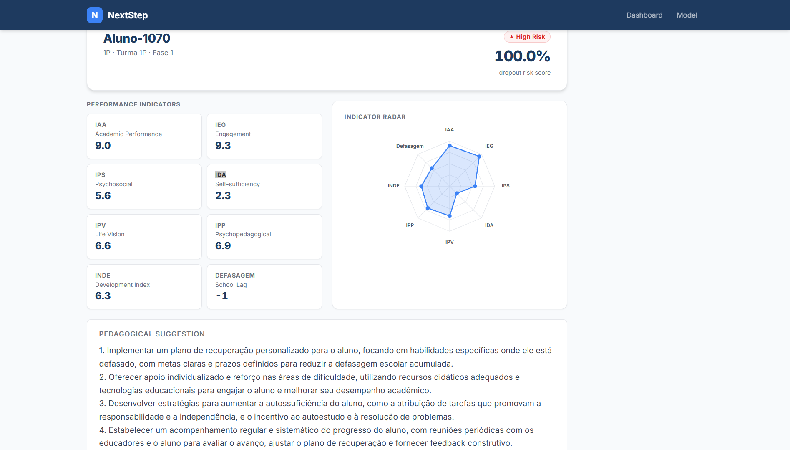

# NextStep — Student Risk Advisor

> Plataforma de inteligência preditiva para coordenadores pedagógicos identificarem e apoiarem estudantes em risco de defasagem acadêmica.

**Stack**: LSTM (PyTorch) · Flask 3 · React 18 · MLflow 2 · Groq LLM · Docker Compose  
**Dataset**: PEDE 2022-2024 (FIAP Datathon) · 1 156 alunos ativos · previsão para ciclo 2025  
**Último modelo**: v37 @prod · AUC=0.827 · F1=0.762 · threshold=0.284 (PR curve) · Optuna 20 trials



---

## Sobre a Associação Passos Mágicos

> *"Mudando a vida de crianças e jovens por meio da educação."*

A **Associação Passos Mágicos** tem uma trajetória de 32 anos de atuação e trabalha na transformação da vida de crianças e jovens de baixa renda, levando-os a melhores oportunidades de vida. A associação busca instrumentalizar a educação como ferramenta para a mudança das condições de vida de crianças e jovens em vulnerabilidade social.

O **NextStep** foi desenvolvido com base no dataset de pesquisa extensiva do desenvolvimento educacional da associação nos anos de 2022, 2023 e 2024 (PEDE), com o objetivo de ajudar coordenadores pedagógicos a identificar precocemente alunos em risco e agir de forma mais eficaz.
| Docker + Docker Compose | 24+ |

### 1. Configurar variáveis de ambiente

```bash
cp .env.example .env
# Edite .env e preencha GROQ_API_KEY=gsk_...
```

### 2. Subir o MLflow

```bash
docker compose up mlflow -d
# Aguarde ficar healthy antes de continuar
docker compose ps mlflow   # Status deve ser "healthy"
# MLflow UI: http://localhost:5000
```

### 3. Adicionar o dataset

Coloque o arquivo XLSX do PEDE na pasta git-ignorada:

```bash
mkdir -p backend/data/raw
cp /caminho/para/"BASE DE DADOS PEDE 2022-2024 - DATATHON.xlsx" backend/data/raw/
```

### 4. ETL — processar o dataset

```bash
docker compose run --rm --no-deps api python ml/data_loader.py
# Gera em backend/data/processed/:
#   X_train.npy  y_train.npy
#   X_test.npy   y_test.npy
#   X_inference.npy (alunos 2024, sem target)
#   scaler.pkl (RobustScaler fitado no treino)
#   students_meta.pkl (metadados para a API)
```

### 5. Treinar o modelo

```bash
# Treino direto (defaults ou --config best_params.json)
docker compose run --rm api python ml/train.py

# HPO com Optuna — N trials, retreina com o melhor automaticamente
docker compose run --rm api python ml/tune.py --trials 30

# HPO só busca, sem retreinar
docker compose run --rm api python ml/tune.py --trials 30 --no-train
# O melhor modelo é promovido para @staging e @prod automaticamente
```

### 6. Promover o modelo para produção

```bash
docker compose run --rm --no-deps api python -c "
import mlflow, os
from mlflow import MlflowClient
uri = os.getenv('MLFLOW_TRACKING_URI', 'http://mlflow:5000')
mlflow.set_tracking_uri(uri)
c = MlflowClient(uri)
versions = c.search_model_versions(\"name='nextstep-lstm'\")
latest = max(int(v.version) for v in versions)
c.set_registered_model_alias('nextstep-lstm', 'prod', str(latest))
print(f'@prod definido na versao {latest}')
"
```

Ou manualmente: http://localhost:5000 → Models → `nextstep-lstm` → versão mais recente → Aliases → `prod`

### 7. Subir todos os serviços

```bash
docker compose up --build
```

| Serviço | URL |
|---|---|
| Frontend (React) | http://localhost:3000 |
| API (Flask) | http://localhost:8080 |
| MLflow UI | http://localhost:5000 |

> **Novo modelo em produção**: após treinar e promover o alias, basta `docker compose restart api`.

> **Dados persistidos**: `backend/data/processed/` e `mlruns/` são bind mounts — `docker compose down` **não** apaga os artefatos.

---

## Estrutura do Projeto

```
nextstep/
├── backend/
│   ├── app/                     # Flask application (SOLID)
│   │   ├── domain/              # Entidades + ports (interfaces)
│   │   ├── repositories/        # MLflow model + student data
│   │   ├── services/            # Prediction, cache, LLM
│   │   ├── routes.py            # Endpoints REST
│   │   └── __init__.py          # Flask factory (create_app)
│   ├── ml/                      # ML pipeline
│   │   ├── models/              # LSTMClassifier (PyTorch)
│   │   ├── training/            # TrainingLoop, Evaluator, Registry, HPO
│   │   ├── data_loader.py       # ETL: PEDE XLSX → .npy + scaler
│   │   ├── train.py             # Entrypoint: treino + quality gate + registro
│   │   └── tune.py              # Entrypoint: HPO Optuna → best params → train
│   ├── scripts/             # Exploratório / legado (Sprint 1)
│   ├── tests/
│   ├── data/
│   │   ├── raw/                 # XLSX original (git-ignored)
│   │   └── processed/           # .npy, scaler.pkl, students_meta.pkl (git-ignored)
│   ├── Dockerfile
│   ├── .dockerignore
│   ├── requirements.txt
│   └── pyproject.toml
├── frontend/
│   ├── src/
│   │   ├── components/
│   │   ├── pages/
│   │   ├── services/api.ts
│   │   ├── types/student.ts
│   │   └── main.tsx
│   ├── Dockerfile
│   └── package.json
├── docker-compose.yml           # Dev (hot-reload via volume mounts)
├── docker-compose-prod.yml      # Prod (código baked na imagem)
└── .env.example
```

---

## API

### `GET /health`
```json
{ "status": "ok", "model_loaded": true, "student_count": 1156 }
```

### `GET /api/students`
Lista estudantes ordenados por risco (desc).
```json
{
  "students": [
    { "student_id": 215, "display_name": "Aluno-750", "phase": "1B",
      "risk_score": 0.9877, "risk_tier": "high" }
  ],
  "total": 1156
}
```

### `GET /api/students/:id`
Perfil completo com indicadores. IPP é exibido mas **não** entra no modelo.
```json
{
  "student_id": 215, "display_name": "Aluno-750", "phase": "1B",
  "class_group": "A", "risk_score": 0.9877, "risk_tier": "high", "fase_num": 1,
  "indicators": { "iaa": 6.249, "ieg": 5.939, "ips": 4.38,
                  "ida": 3.75, "ipv": 3.177, "ipp": 4.063, "inde": 4.542,
                  "defasagem": -2 }
}
```

### `GET /api/students/:id/advice`
Sugestão pedagógica gerada pelo Groq (sempre HTTP 200).
```json
{
  "student_id": 215, "advice": "...", "is_fallback": false,
  "generated_at": "2026-02-28T12:00:00+00:00"
}
```

### `POST /api/predict`
Predição on-demand para valores brutos de indicadores (não precisa ser um aluno do dataset).
Útil para simulações e testes de what-if. Todos os campos são opcionais (padrão: 0).
```json
// Request body
{
  "iaa": 7.2, "ieg": 6.5, "ips": 5.0, "ida": 4.0,
  "ipv": 6.0, "inde": 6.8, "defasagem": -1,
  "fase_num": 3, "gender": 0, "age": 14
}

// Response
{ "risk_score": 0.3124, "risk_tier": "medium", "input": { ... } }
```
Limitado a 60 requisições/hora por IP. IPP não entra no modelo (display-only).

---

## Pipeline de ML

| Etapa | Detalhe |
|-------|---------|
| **Features** | IAA, IEG, IPS, IDA, IPV, INDE, defasagem, fase\_num, gender, age (INPUT\_SIZE=10) |
| **IPP** | Display-only — ausente em 2022, imputado para exibição, não entra no modelo |
| **IAN** | Removido — data leakage (correlação 0.84–0.87 com o target) |
| **Split** | Temporal: 2022→2023 treino / 2023→2024 teste / 2024 inferência |
| **Missing (treino)** | DROP — linhas com null em qualquer feature são descartadas |
| **Missing (inferência)** | IMPUTE com medianas do treino — NaN e IEG/IDA=0 são tratados como ausentes (≈9% dos alunos 2024) |
| **Zeros IEG/IDA** | IEG=0 (9,4 %) e IDA=0 (1,4 %) são prováveis erros de registro — imputados pela mediana da fase no treino para o modelo; valor original 0 é preservado para exibição no frontend com aviso ⚠️ |
| **Scaler** | `RobustScaler` (mediana+IQR, clip±5) — robusto a outliers |
| **Threshold** | Otimizado via curva PR no validation set (20% do treino) — nunca no test |
| **Modelo** | LSTM 2 camadas hidden\_size=128, BCEWithLogitsLoss com pos\_weight · otimizado via Optuna (20 trials) |
| **Tracking** | MLflow: params, métricas, scaler como artefato, alias @staging/@prod |
| **HPO** | Optuna: N trials por experimento, cada trial = child MLflow run, melhor retrained e promovido |

### Fluxo de dados

```
┌─────────────────────────────────────────────────────────────────────┐
│  OFFLINE  —  data_loader.py                                         │
│                                                                     │
│  PEDE .xlsx  →  ETL / limpeza  →  feature eng  →  RobustScaler     │
│             →  salva como .npy  (formato portátil, sem framework)   │
│                                                                     │
│  data/processed/                                                    │
│    X_train.npy   (n_samples, n_features)                            │
│    y_train.npy   (n_samples,)                                       │
│    X_test.npy                                                       │
│    y_test.npy                                                       │
│    X_inference.npy   ← alunos 2024, sem target                      │
│    scaler.pkl                                                       │
└──────────────────────────┬──────────────────────────────────────────┘
                           │
                           ▼
┌─────────────────────────────────────────────────────────────────────┐
│  TRAINING TIME  —  ml/train.py  (ou  ml/tune.py  para HPO)        │
│                                                                     │
│  1. np.load("X_train.npy")          # ndarray, sem dependência ML   │
│  2. temporal val split (20%)        # mantém ordem cronológica      │
│  3. torch.from_numpy(arr)           # converte para tensor PyTorch  │
│     .unsqueeze(1)                   # → (N, seq_len=1, n_features)  │
│  4. TrainingLoop  →  LSTM + Adam + BCEWithLogitsLoss(pos_weight)    │
│  5. Evaluator.find_threshold()      # curva PR no val set           │
│  6. Evaluator.evaluate()            # AUC + F1 no test set          │
│  7. quality gate  →  MLflowRegistry.log_run() + promote @prod       │
└──────────────────────────┬──────────────────────────────────────────┘
                           │
                           ▼
┌─────────────────────────────────────────────────────────────────────┐
│  INFERENCE TIME  —  app/services/prediction.py                      │
│                                                                     │
│  np.load("X_inference.npy")  →  tensor  →  model(@prod)  →  score  │
└─────────────────────────────────────────────────────────────────────┘
```

### Comandos de treino

```bash
# ETL — gera os .npy (necessário uma vez)
docker compose run --rm api python ml/data_loader.py

# Treino direto com defaults (ou --config best_params.json)
docker compose run --rm api python ml/train.py

# HPO — N trials Optuna, salva best_params.json e retreina
docker compose run --rm api python ml/tune.py --trials 30

# HPO só busca, sem retreinar
docker compose run --rm api python ml/tune.py --trials 30 --no-train
```

---

## Testes

```bash
# Backend
cd backend
pip install -r requirements.txt
pytest tests/ -v

# Frontend
cd frontend
npm ci
npm test -- --run
```

---

## Qualidade de Código

```bash
# Python (Ruff, line-length=120)
ruff check backend/

# TypeScript
cd frontend && npm run lint
```

---

## Variáveis de Ambiente

| Variável | Descrição | Obrigatório |
|---|---|---|
| `GROQ_API_KEY` | Chave da API Groq | Sim (para advice) |
| `MLFLOW_TRACKING_URI` | URL do servidor MLflow | Sim |
| `VITE_API_BASE_URL` | URL base da API (frontend) | Sim |

---

## Thresholds de Risco

| Tier | Faixa | Badge |
|---|---|---|
| `high` | score ≥ 0.7 | 🔴 Red |
| `medium` | 0.3 ≤ score < 0.7 | 🟡 Yellow |
| `low` | score < 0.3 | 🟢 Green |

---

## Licença

Projeto acadêmico — FIAP Datathon 2026.
