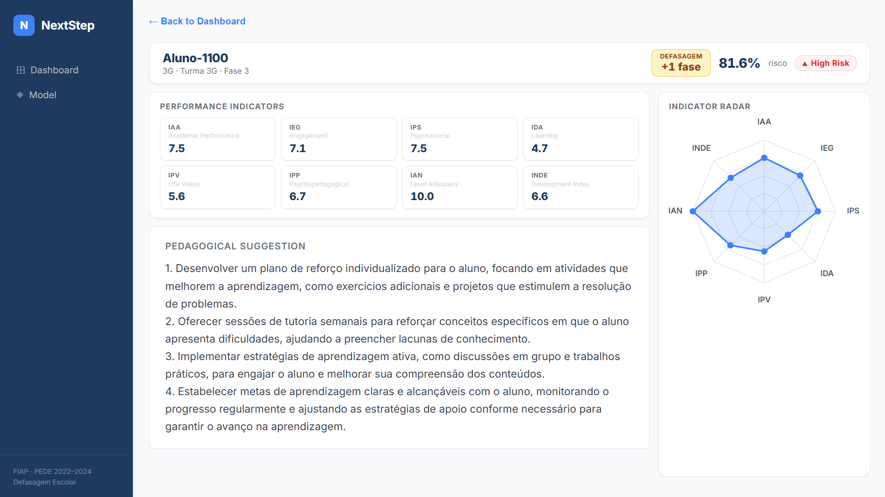

# NextStep — Student Risk Advisor

> Predictive intelligence platform for academic coordinators to identify and support students at risk of academic lag.

**Stack**: LSTM (PyTorch) · LightGBM · Flask 3 · React 18 · MLflow 2 · Groq LLM · Docker · Kubernetes (GKE)
**Dataset**: PEDE 2022-2024 (FIAP Datathon) · 1,156 active students · forecast for the 2024 cycle
**Latest model**: v261 @prod · AUC=0.832 · F1=0.589 · threshold=0.19 (PR curve) · Optuna HPO



---

## About Associação Passos Mágicos

> *"Changing the lives of children and youth through education."*

The **Associação Passos Mágicos** has a 32-year history and works to transform the lives of low-income children and youth, giving them access to better life opportunities. The association uses education as a tool to change the living conditions of socially vulnerable children and youth.

**NextStep** was developed based on the association's extensive educational development research dataset for the years 2022, 2023, and 2024 (PEDE), with the goal of helping academic coordinators identify at-risk students early and act more effectively.

**1. Configure environment variables**

```bash
cp .env.example .env
# Edit .env and fill in GROQ_API_KEY=gsk_...
```

### 2. Start MLflow

```bash
docker compose up mlflow -d
# Wait until healthy before continuing
docker compose ps mlflow   # Status should be "healthy"
# MLflow UI: http://localhost:5000
```

### 3. Add the dataset

Place the PEDE XLSX file in the git-ignored folder:

```bash
mkdir -p backend/data/raw
cp /path/to/"BASE DE DADOS PEDE 2022-2024 - DATATHON.xlsx" backend/data/raw/
```

### 4. ETL — process the dataset

```bash
docker compose run --rm --no-deps api python ml/data_loader.py
# Generates in backend/data/processed/:
#   X_train.npy  y_train.npy
#   X_test.npy   y_test.npy
#   X_inference.npy (2024 students, no target)
#   scaler.pkl (RobustScaler fitted on training data)
#   students_meta.pkl (metadata for the API)
```

### 5. Train the model

```bash
# Direct training (defaults or --config best_params.json)
docker compose run --rm api python ml/train.py

# HPO with Optuna — N trials, retrains with the best automatically
docker compose run --rm api python ml/tune.py --trials 30

# HPO search only, without retraining
docker compose run --rm api python ml/tune.py --trials 30 --no-train
# The best model is automatically promoted to @staging and @prod
```

### 6. Promote the model to production

```bash
docker compose run --rm --no-deps api python -c "
import mlflow, os
from mlflow import MlflowClient
uri = os.getenv('MLFLOW_TRACKING_URI', 'http://mlflow:5000')
mlflow.set_tracking_uri(uri)
c = MlflowClient(uri)
versions = c.search_model_versions(\"name='nextstep-lstm'\")
latest = max(int(v.version) for v in versions)
c.set_registered_model_alias('nextstep-lstm', 'prod', str(latest))
print(f'@prod set to version {latest}')
"
```

Or manually: http://localhost:5000 → Models → `nextstep-lstm` → latest version → Aliases → `prod`

### 7. Start all services

```bash
docker compose up --build
```

| Service          | URL                   |
| ---------------- | --------------------- |
| Frontend (React) | http://localhost:3000 |
| API (Flask)      | http://localhost:8080 |
| MLflow UI        | http://localhost:5000 |

> **New model in production**: after training and promoting the alias, simply run `docker compose restart api`.

> **Persisted data**: `backend/data/processed/` and `mlruns/` are bind mounts — `docker compose down` does **not** delete the artifacts.

---

## Project Structure

```
nextstep/
├── backend/
│   ├── app/                       # Flask application (SOLID)
│   │   ├── domain/                # Entities + ports (interfaces)
│   │   ├── repositories/          # MLflow model + student data
│   │   ├── services/              # Prediction, cache, LLM
│   │   ├── routes.py              # REST Endpoints
│   │   ├── swagger_config.py      # Flasgger/Swagger setup
│   │   ├── limiter.py             # Rate limiting (flask-limiter)
│   │   └── __init__.py        
│   ├── ml/                        # ML pipeline
│   │   ├── models/                # LSTMClassifier (PyTorch)
│   │   ├── training/              # trainer.py, evaluator.py, registry.py, hpo.py
│   │   ├── data_loader.py         # ETL: PEDE XLSX → .npy + scaler
│   │   ├── train.py               # Entrypoint LSTM: training + quality gate + registration
│   │   ├── train_lgbm.py          # Entrypoint LightGBM: training + quality gate + registration
│   │   ├── tune.py                # HPO Optuna → LSTM
│   │   └── tune_lgbm.py           # HPO Optuna → LightGBM
│   ├── scripts/                   # Exploratory / analyses (not production)
│   ├── tests/                     # pytest (test_api, test_data_loader, test_lgbm_train, ...)
│   ├── data/
│   │   ├── raw/                   # Original XLSX (git-ignored)
│   │   └── processed/             # .npy, scaler.pkl, students_meta.pkl (git-ignored)
│   ├── Dockerfile
│   ├── requirements.txt           # Dev (includes torch CUDA, pytest, ruff)
│   ├── requirements-prod.txt      # Runtime only (without torch CUDA)
│   └── pyproject.toml             # ruff + pytest config
├── frontend/
│   ├── src/
│   │   ├── components/
│   │   ├── pages/
│   │   ├── services/              # api.ts, studentCache.ts
│   │   ├── styles/
│   │   ├── types/
│   │   └── main.tsx
│   ├── Dockerfile
│   └── package.json
├── mlflow/                        # Custom MLflow server Dockerfile
├── k8s/                           # Kubernetes Manifests (GKE)
│   ├── backend-deployment.yaml
│   ├── frontend-deployment.yaml
│   ├── mlflow-deployment.yaml
│   ├── ingress.yaml
│   ├── hpa.yaml
│   └── ...
├── .github/
│   └── workflows/
│       ├── ci.yaml                # lint + tests (backend + frontend)
│       ├── deploy.yaml            # Docker build + GKE deploy (post CI)
│       └── train.yaml             # training on ephemeral GKE cluster
├── docs/        
├── docker-compose.yml             # Dev (hot-reload via volume mounts)
├── docker-compose-prod.yml        # Prod (code baked into the image)
├── app.py                         # Unified Docker Compose runner
└── .env.example
```

---

## API

### `GET /health`

```json
{ "status": "ok", "model_loaded": true, "student_count": 1156 }
```

### `GET /api/students`

Lists students sorted by risk (desc).

```json
{
  "students": [
    { "student_id": 215, "display_name": "Aluno-750", "phase": "1B",
      "risk_score": 0.9877, "risk_tier": "high" }
  ],
  "total": 1156
}
```

### `GET /api/students/:id`

Full profile with indicators. IPP is displayed but does **not** enter the model.

```json
{
  "student_id": 215, "display_name": "Aluno-750", "phase": "1B",
  "class_group": "A", "risk_score": 0.9877, "risk_tier": "high", "fase_num": 1,
  "indicators": { "iaa": 6.249, "ieg": 5.939, "ips": 4.38,
                  "ida": 3.75, "ipv": 3.177, "ipp": 4.063, "inde": 4.542,
                  "defasagem": -2 }
}
```

### `GET /api/students/:id/advice`

Pedagogical suggestion generated by Groq (always HTTP 200).

```json
{
  "student_id": 215, "advice": "...", "is_fallback": false,
  "generated_at": "2026-02-28T12:00:00+00:00"
}
```

### `POST /api/predict`

On-demand prediction for raw indicator values (does not need to be a student in the dataset).
Useful for simulations and what-if tests. All fields are optional (default: 0).

```json
// Request body
{
  "iaa": 7.2, "ieg": 6.5, "ips": 5.0, "ida": 4.0,
  "ipv": 6.0, "inde": 6.8, "defasagem": -1,
  "fase_num": 3, "gender": 0, "age": 14
}

// Response
{ "risk_score": 0.3124, "risk_tier": "medium", "input": { ... } }
```

Limited to 60 requests/hour per IP. IPP does not enter the model (display-only).

---

## Unified Runner (docker)

The project includes a Docker-only runner at the root:

```bash
# starts stack with compose
python app.py

# docker mode with clean build (no cache)
python app.py --no-cache
```

Useful flags:

- `--dry-run`: prints commands without executing
- `--detach`: uses `docker compose up -d --build`

---

## ML Pipeline

| Stage                           | Detail                                                                                                                                                                                              |
| ------------------------------- | ---------------------------------------------------------------------------------------------------------------------------------------------------------------------------------------------------- |
| **Features**              | IAA, IEG, IPS, IDA, IPV, IAN, INDE, defasagem, fase\_num, gender, age, tenure, n\_av, mat, por, missing\_grades (INPUT\_SIZE=16)                                                                     |
| **IPP**                   | Display-only — absent in 2022, imputed for display, does not enter the model                                                                                                                      |
| **mat / por**             | Math and Portuguese grades; `missing_grades` flag + imputation by phase median fitted on training (no leakage)                                                                          |
| **Split**                 | Temporal: 2022→2023 train / 2023→2024 test / 2024 inference                                                                                                                                    |
| **Missing (training)**      | DROP — rows with null in any feature are discarded                                                                                                                                         |
| **Missing (inference)** | IMPUTE with training medians — NaN and IEG/IDA=0 are treated as missing (≈9% of 2024 students)                                                                                                  |
| **Zeros IEG/IDA**         | IEG=0 (9.4%) and IDA=0 (1.4%) are likely recording errors — imputed by phase median in training for the model; original value 0 is preserved for frontend display with a ⚠️ warning |
| **Scaler**                | `RobustScaler` (median+IQR, clip±5) — robust to outliers                                                                                                                                        |
| **Threshold**             | Optimized via PR curve on validation set (20% of training) — never on test                                                                                                                            |
| **Model**                | LSTM 1 layer hidden\_size=128, BCEWithLogitsLoss with pos\_weight · or LightGBM with dynamic scale\_pos\_weight · both optimized via Optuna                                                     |
| **Tracking**              | MLflow: params, metrics, scaler as artifact, alias @staging/@prod                                                                                                                                |
| **HPO**                   | Optuna: N trials per experiment, each trial = child MLflow run, best retrained and promoted                                                                                                        |

### Data Flow

```
┌─────────────────────────────────────────────────────────────────────┐
│  OFFLINE  —  data_loader.py                                         │
│                                                                     │
│  PEDE .xlsx  →  ETL / cleaning  →  feature eng  →  RobustScaler    │
│             →  saves as .npy  (portable format, framework-free)     │
│                                                                     │
│  data/processed/                                                    │
│    X_train.npy   (n_samples, n_features)                            │
│    y_train.npy   (n_samples,)                                       │
│    X_test.npy                                                       │
│    y_test.npy                                                       │
│    X_inference.npy   ← 2024 students, no target                     │
│    scaler.pkl                                                       │
└──────────────────────────┬──────────────────────────────────────────┘
                           │
                           ▼
┌─────────────────────────────────────────────────────────────────────┐
│  TRAINING TIME  —  ml/train.py  (or  ml/tune.py  for HPO)         │
│                                                                     │
│  1. np.load("X_train.npy")          # ndarray, no ML dependency    │
│  2. temporal val split (20%)        # maintains chronological order │
│  3. torch.from_numpy(arr)           # converts to PyTorch tensor    │
│     .unsqueeze(1)                   # → (N, seq_len=1, n_features)  │
│  4. TrainingLoop  →  LSTM + Adam + BCEWithLogitsLoss(pos_weight)    │
│  5. Evaluator.find_threshold()      # PR curve on val set           │
│  6. Evaluator.evaluate()            # AUC + F1 on test set          │
│  7. quality gate  →  MLflowRegistry.log_run() + promote @prod       │
└──────────────────────────┬──────────────────────────────────────────┘
                           │
                           ▼
┌─────────────────────────────────────────────────────────────────────┐
│  INFERENCE TIME  —  app/services/prediction.py                      │
│                                                                     │
│  np.load("X_inference.npy")  →  tensor  →  model(@prod)  →  score  │
└─────────────────────────────────────────────────────────────────────┘
```

### Training Commands

```bash
# ETL — generates the .npy files (required once)
docker compose run --rm api python ml/data_loader.py

# Direct training with defaults (or --config best_params.json)
docker compose run --rm api python ml/train.py

# HPO — N Optuna trials, saves best_params.json and retrains
docker compose run --rm api python ml/tune.py --trials 30

# HPO search only, without retraining
docker compose run --rm api python ml/tune.py --trials 30 --no-train
```

---

## CI/CD

```
Push → main branch
  │
  ▼
[ CI ] GitHub Actions
  ├── backend-ci:  ruff lint + pytest
  └── frontend-ci: eslint + vitest
  │
  ▼  (only if CI passed)
[ Deploy ] GitHub Actions
  ├── build-mlflow  ┐
  ├── build-backend ├── docker build + push → Artifact Registry  (parallel)
  └── build-frontend┘
  │
  └── deploy:
        gcloud run deploy nextstep-mlflow
        kubectl set image nextstep-api
        kubectl set image nextstep-web

[ Train ] workflow_dispatch (manual)
  ├── Creates ephemeral GKE cluster (e2-standard-2)
  ├── Kubernetes Job: HPO (Optuna) + training + MLflow registration
  ├── Destroys cluster
  └── (optional) promotes @staging → @prod
```

## Tests

```bash
# Backend
cd backend
pip install -r requirements.txt
pytest tests/ -v

# Frontend
cd frontend
npm ci
npm test -- --run
```

---

## Code Quality

```bash
# Python (Ruff, line-length=120)
ruff check backend/

# TypeScript
cd frontend && npm run lint
```

---

## Environment Variables

| Variable               | Description                | Required      |
| ----------------------- | -------------------------- | ----------------- |
| `GROQ_API_KEY`        | Groq API key               | Yes (for advice) |
| `MLFLOW_TRACKING_URI` | MLflow server URL          | Yes               |
| `VITE_API_BASE_URL`   | Base API URL (frontend)    | Yes               |

---

## Risk Thresholds

| Tier       | Range              | Badge     |
| ---------- | ------------------ | --------- |
| `high`   | score ≥ 0.7       | 🔴 Red    |
| `medium` | 0.3 ≤ score < 0.7 | 🟡 Yellow |
| `low`    | score < 0.3        | 🟢 Green  |

---

## License

Academic project — FIAP Datathon 2026.
